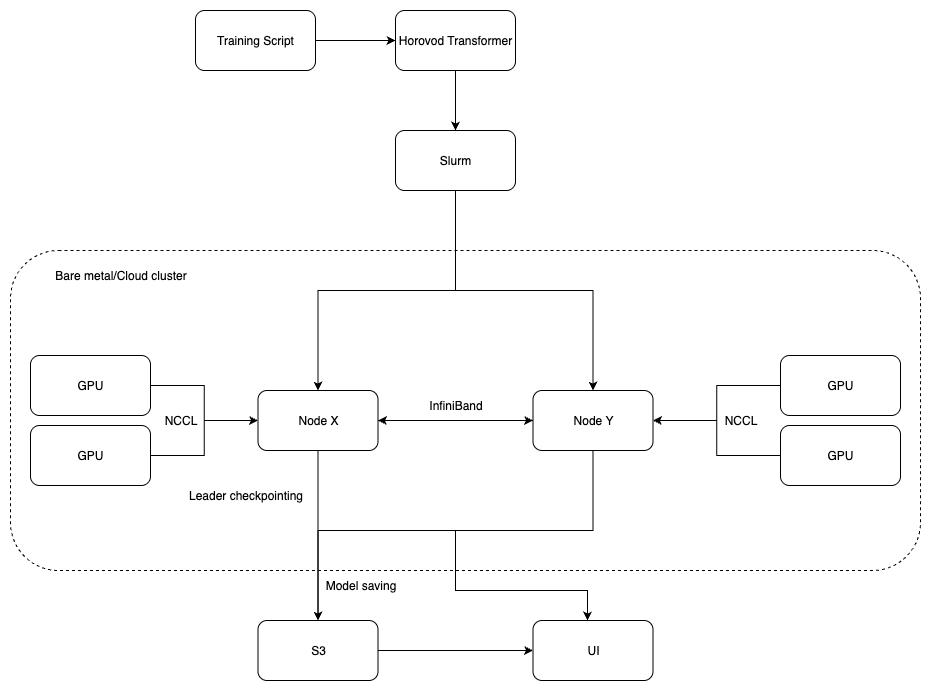

# DTO - Distributed Training Orchestrator

A lightweight, framework-agnostic tool that simplifies distributed training on bare metal or cloud GPU clusters with built-in observability and checkpointing mechanisms.

## Overview

DTO eliminates the complexity of setting up and managing distributed training workloads across GPU clusters. Whether you're running on bare metal servers or cloud infrastructure, DTO provides a unified interface for distributed training with automatic resource management, fault tolerance, and comprehensive monitoring.



## Key Features

- **Simple**: Simplifies distributed training for on-premises and bare-metal clusters
- **Frictionless**: Transform conventional training loops with a built-in framework for distributed training
- **Scalable**: Abstracts SLURM job submission and GPU allocation
- **Reliable**: Built-in checkpointing, logging, and automatic final model saving
- **Observability**: UI to monitor real-time training progress, resource utilization, and compare metrics
- **Vendor-neutral**: Deploy on AWS or bare metal infrastructure
- **Cost-effective**: Manage workloads through reserved/spot instances instead of managed services

## Quick Start

### Basic Usage
1. Copy training script to master node
2. SSH to master node
3. Run `submit_job.sh your_script.py`

## Infrastructure Deployment

### AWS Deployment

```bash
terraform init
terraform plan -out=tfplan
terraform apply
cluster-setup.sh [ARGS]
```

### Bare Metal Setup

```bash
cluster-setup.sh [ARGS]
```

## Project Structure

```
dto/
├── src/dto/
│   └── distributed_trainer.py    # Core training framework
├── src/examples/
│   ├── framework_example.py      # Comprehensive usage examples
│   └── simple_net.py            # Basic neural network example
├── terraform/
│   ├── modules/horovod-hpc/     # HPC cluster infrastructure
│   └── examples/                # Deployment examples
├── scripts/
│   └── cluster-setup.sh         # Cluster configuration script
└── pyproject.toml              # Package configuration
```

## Support

For questions, issues, or feature requests:
- Create an issue on GitHub
- Review examples in `src/examples/`

## Acknowledgments

- Built on top of [Horovod](https://github.com/horovod/horovod) for distributed training
- Uses [SLURM](https://slurm.schedmd.com/) for workload management
- Infrastructure managed with [Terraform](https://www.terraform.io/)
